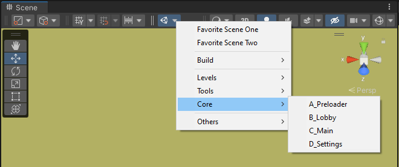
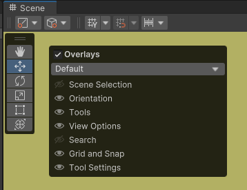
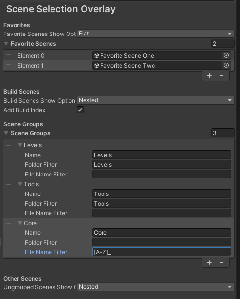

# Scene Selection Overlay

This package for Unity provides a Toolbar Overlay for the SceneView to easily change between Scenes.

# How To Use

1. Enable Overlay:  
   Click in the Scene View and press the Spacebar.  
   
   Select "Scene Selection" in the appearing Overlay  
2. (optional) Configure Favorite Scenes, Define Groups and finetune Appearance:  
   Go to the ProjectSettings -> Tools -> Scene Selection Overlay  
   
3. Click on the Unity Scene Button in the SceneView Toolbar to open the Menu
4. Navigate the Menu and select the Scene you want to open.

# Features

## Favorite Scenes

Add your favorite Scenes in the Settings so they always appear at the top of the Overlay Menu.

`FavoriteScenesShowOptions` allows you to select how the favorites should be handled.

* Hidden: Don't Show Scenes
* Flat: Show Scenes directly in the Root of the Menu
* Nested: Show Scenes in the Submenu "Favorites"  

Scenes can easily be added to the Favorites with right clicking the SceneAsset in the Project Window and Select "Add/Remove to Favorites"

## Show Scenes Added to Build

`Build Scenes Show Option` defines how Scenes added to the Build should be displayed: 

* Hidden: Don't Show Scenes
* Flat: Show Scenes directly in the Root of the Menu
* Nested: Show Scenes in the Submenu "Build"  

`Add Build Index` toggles if the Scene Name should be prefixed with the Build Index

## Groups 

The Scenes can be grouped as needed by filters that can be defined in the Settings.
Go to ProjectSettings -> Tools -> Scene Selection Overlay to configure your Groups.

A Group is defined by three settings: Name, Folder Filter and File Name Filter.

### Name

The Name of the Group, this Name is used in the Menu. 
You can use "/" to create different Submenus.

### Folder Filter

Regex Filter for the File Path excluding the File Name. Always use "/" as Directory Separator.

The Regex evaluation ignores Case. 

The Filter can be inverted by adding a Exclamation Mark '!' at the beginning of the Filter.

### File Name Filter
Regex Filter for the File Name.

The Regex evaluation ignores Case.

The Filter can be inverted by adding a Exclamation Mark '!' at the beginning of the Filter.

### Ungrouped Scenes Show Option 

This Setting defines how Scenes that did not match any group should be displayed: 

* Hidden: Don't Show Scenes
* Flat: Show Scenes directly in the Root of the Menu
* Nested: Show Scenes in the Submenu "Others"  

# Installing with Unity Package Manager

To install this project as a Git dependency using the Unity Package Manager, add the following line to your project's manifest.json:

"ch.elhodel.scene-selection-overlay": "https://github.com/elhodel/SceneSelectionOverlay.git"

Or open the Package Manager in Unity and add the Package with "Add Package from git URL..." and paste this URL: "https://github.com/elhodel/SceneSelectionOverlay.git"

You will need to have Git installed and available in your system's PATH.

# Credits

This Package is inspired by Warped Imaginations Youtube Video https://www.youtube.com/watch?v=yqneLnM8syk